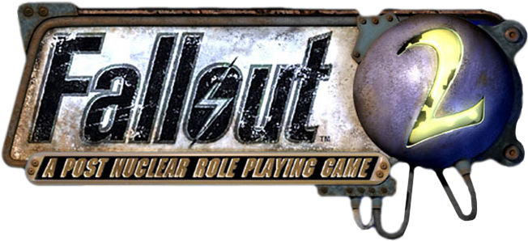

## Fallout 2 Restoration Project, updated 

[__Download__](https://github.com/BGforgeNet/Fallout2_Restoration_Project/releases/latest)
| [__Installation__](#installation)
| [__Bug reports__](#bug-reports-feature-requests)
| [__Translations__](docs/translations.md)
| [__Additional mods__](#additional-mods)

This is an updated version of [killap's Restoration Project](http://killap.net/) for Fallout 2.

Docs: [changelog](docs/changelog.md), [original readme](docs/rp-readme.txt), [new content description](docs/rp-new_content.txt) (spoilers), [walkthrough](http://hem.bredband.net/darek1/f2rp_wt.htm) (heavy spoilers), [credits](docs/credits.md).

### Installation
- RPU must be installed on vanilla game.
- RPU requires starting a **new game** after installation.

(One exception is [updating](docs/update.md) from UP or a previous UPU version).

#### Windows
1. Download `rpu_v*.exe` from the [latest release](https://github.com/BGforgeNet/Fallout2_Restoration_Project/releases/latest) page.
1. Launch, point the installer to the game directory, choose language and options.
1. After installation, see `mods/rpu.ini` for various settings that can be configured.

### Additional mods
#### Included
RPU includes the following mods:
- [Unofficial Patch](https://github.com/BGforgeNet/Fallout2_Unofficial_Patch)
- [High quality music](https://github.com/BGforgeNet/Fallout2-HQ-music)
- [Hero Appearance](https://github.com/BGforgeNet/Fallout2_Hero_Appearance)
- [NPC armor](https://github.com/BGforgeNet/Fallout2_NPC_Armor)
- [Party Orders](https://github.com/BGforgeNet/Fallout2_Party_Orders)
- Enhanced worldmap
- Additional rifle and wakizashi animations
- Improved Mysterious Stranger
- Voice for Cassidy
- High resolution patch.

#### Recommended
For additional QoL options, check out:
- [Ultra HQ music](https://github.com/BGforgeNet/Fallout2-HQ-music)
- [FO2tweaks](https://github.com/BGforgeNet/FO2tweaks)
- [Inventory filter](https://nma-fallout.com/threads/inventory-filter.214445/)

### Bug reports, feature requests
1. Go to [github issues](https://github.com/Fallout2_Restoration_Project/issues) or [forums](https://forums.bgforge.net/viewforum.php?f=39).
2. Open an issue/topic, describe the bug. Report each bug separately.
3. Attach a savegame and a screenshot.

### Additional info
[__Changelog__](docs/changelog.md)
| [__New content description__](rp-new_content.txt) (spoilers)
| [__Walkthrough__](http://hem.bredband.net/darek1/f2rp_wt.htm) (heavy spoilers)
| [__Known issues__](docs/known.md)
| [__Reporting crashes__](https://github.com/BGforgeNet/Fallout2_Unofficial_Patch/blob/master/docs/crash.md)
| [__Credits__](docs/credits.md).
